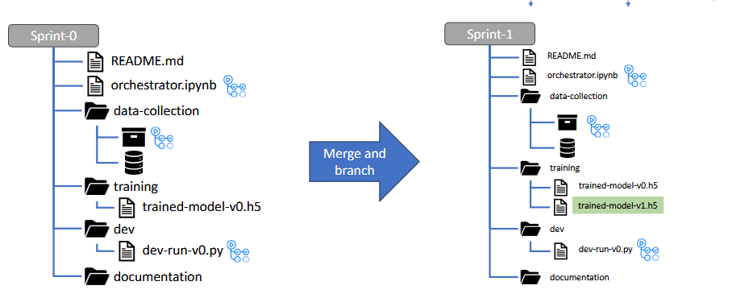

# INFO8665--Airplane
Predicting flight patterns for DSS

## Project Description
This project focuses on building a machine learning model to predict airplane fare prices based on factors like airline, journey date, source, destination, and total stops. The project is developed collaboratively using **GitHub** and **Azure Boards** for effective project management and collaboration.

## **Goals**
- Develop a robust fare prediction model with optimized performance.
- Implement CI/CD workflows for smooth integration and deployment.
- Collaborate efficiently using Azure Boards and GitHub workflows.


Team Members
| Student ID | Name |
|--------------------------------|---------------------|
| 8930180 | Jaiv Burman |
| 8952840 | Harsh Joshi |
| 8993410 | Prashansa Rathod |
| 8983991 | Nilkumar Patel |
| 9041129 | Nidhi Ahir |

## **Project Workflow Structure**
### **Branching Strategy**
- Each feature or task is handled under separate **sprint branches** following a predefined branching structure:
  - `main`: Stable code ready for deployment.
  - `sprint/[sprint-number]`: Contains work done under specific sprints.
  - Development starts with branching from `main` and ends with merging the work back through a **pull request**.
  - The professor will review pull requests before merging them into `main`.

---

### **Pull Request Workflow**
1. Create a new branch for each sprint using the naming convention: `sprint/[task-id]`.
2. Implement the task in the respective branch.
3. Create a pull request with proper description and linked Azure Board tasks.
4. The professor reviews the pull request.
5. If approved, the branch is merged into `main`.

---



---

## **Environment Setup**
To replicate the development environment:
1. **Clone the repository**:  
   ```bash
   git clone https://github.com/JB250101/INFO8665--Airplane.git
   cd INFO8665--Airplane

# 🚀 **Flight Fare Prediction API (MLOps Use Case)**

This repository contains a **Flask-based MLOps pipeline** for predicting flight fares using Machine Learning. It consists of **6 microservices**:

1. **Data Collection Service**: Gathers airfare data from various sources.
2. **Preprocessing Service**: Cleans and prepares raw data.
3. **Feature Engineering Service**: Transforms data into features suitable for modeling.
4. **Training Service**: Trains machine learning models using the processed data.
5. **Inference Service**: Provides predictions based on new input data.
6. **Monitoring & Feedback Service**: Logs predictions and collects user feedback to improve model performance.

## Services

### 1. Data Collection Service

- **Purpose**: Collect airfare data from various sources.
- **Implementation**: Reads airfare data from files or APIs.
- **Status**: ✅ Implemented and operational.

### 2. Preprocessing Service

- **Purpose**: Cleans and preprocesses data before feature engineering.
- **Implementation**:
  - Handles missing values.
  - Parses date and time features.
  - Converts duration to numerical format.
- **Status**: ✅ Implemented and operational.

### 3. Feature Engineering Service

- **Purpose**: Transform raw data into features suitable for modeling.
- **Implementation**:
  - Encodes categorical variables.
  - Scales numerical features.
  - Stores preprocessed features for training.
- **Status**: ✅ Implemented and operational.

### 4. Training Service

- **Purpose**: Train machine learning models on the processed data.
- **Implementation**:
  - Splits data into training and testing sets.
  - Performs hyperparameter tuning using `RandomizedSearchCV`.
  - Trains a `RandomForestRegressor` model.
  - Evaluates model performance.
- **Status**: ✅ Implemented and operational.

### 5. Inference Service

- **Purpose**: Provide airfare price predictions based on new input data.
- **Implementation**:
  - Loads the trained model.
  - Preprocesses input data (encoding and scaling).
  - Returns predicted prices.
- **Status**: ✅ Implemented and operational.

### 6. Monitoring & Feedback Service

- **Purpose**: Log predictions and collect user feedback to improve model performance.
- **Implementation**:
  - Logs each prediction along with input features.
  - Accepts user feedback on prediction accuracy.
  - Provides an admin interface to view logs and feedback.
- **Status**: ⏳ Planned for future implementation.

---

---

## Directory Structure

# INFO8665--AIRPLANE

### Project and environment setup

1. Move to project directory "INFO8665" where you have cloned the project
2. Create virtual environment with name **"airplanevenve"**
    - Make sure ```python --version``` is set to **12.3.6** in your system
    - ```python -m venv airplanevenve```
3. Activate environment
    - ```.\airplanevenve\Scripts\Activate.ps1```
    - In case you are using visual studio code, Choose the environment from menu as active environment
4. Install packages mentioned in **"requirements.txt"**
    - ```pip install -r requirements.txt```
5. Select **"airplanevenve"** environment in your IDE
6. Create folder named **"dataset"** in your project directory
7. Move all files downloaded from Kaggle dataset in the "Dataset" Directory


### Update Requirements.txt file once installing new packages

```pip freeze > requirements.txt```

    
**data/**:
- This directory contains the dataset(s) required for analysis.
- Place any CSV, JSON, or other data files within this directory.

**.gitignore**:
- A configuration file used to exclude certain files and directories from being tracked by Git. 
- Common exclusions include the `airplanevenv/` directory, temporary files, and large datasets.

**airplane.ipynb**:
- The main Jupyter Notebook where data analysis, preprocessing, and model training are performed.
- Open this using Jupyter Notebook or Visual Studio Code to explore the project.

**README.md**:
- This project documentation file explains the structure, setup instructions, and project details.

**docs**:
- This directory contains all the html pages, document report for every sprints

2. **Azure DevOps Integration:**
    Follow Azure Boards integration setup guidelines as outlined in [Azure Boards Link](https://dev.azure.com/Jburman0180/Airplane%20Fare%20Price/).

---

# Downloadables

-   **Training dataset:** Available in the `data/` folder.
    You can download dataset from [Kagglel](https://www.kaggle.com/datasets/shubhamsarafo/flight-price)
-   **Pre-trained models:** Stored in `models/`.

# Pre-requisites
-   Python 3.x installed on the machine.
-   Azure DevOps configured with project access.
-   Git installed and set up.


---

## How to Run the Project

1. Clone the repository:
   ```bash
   git clone <repository-url>
   cd INFO8665--AIRPLANE

2. ## ** Install Required Dependencies**
    Before running the services, install the required Python packages:

```bash
pip install flask pandas scikit-learn joblib requests openpyxl
```

3.  Run Services
Run each service separately:

Data Collection Service:

    ```python data_collection.py```

Preprocessing Service:

    ```python preprocessing.py```
    
Feature Engineering Service:

    ```python feature_engineering.py```
    
Training Service:
    
    ```python training_services.py```

Inference Service:

    ```python inference_service.py```

Monitoring & Feedback Service (Upcoming):

    ```python monitoring_service.py```

4. Access the APIs
Each service exposes an API endpoint:

Data Collection: ```POST http://localhost:5001/collect```

Preprocessing: ```POST http://localhost:5002/preprocess```

Feature Engineering: ```POST http://localhost:5003/feature_engineering```

Training: ```POST http://localhost:5004/train```

Inference: ```POST http://localhost:5005/predict```

Monitoring: ```POST http://localhost:5006/log_prediction```

Feedback: ```GET http://localhost:5006/submit_feedback```


---

Future Work
Implement real-time data collection to keep the model updated.
Enhance the model by incorporating additional features.
Develop a user-friendly front-end interface for easier interaction.


